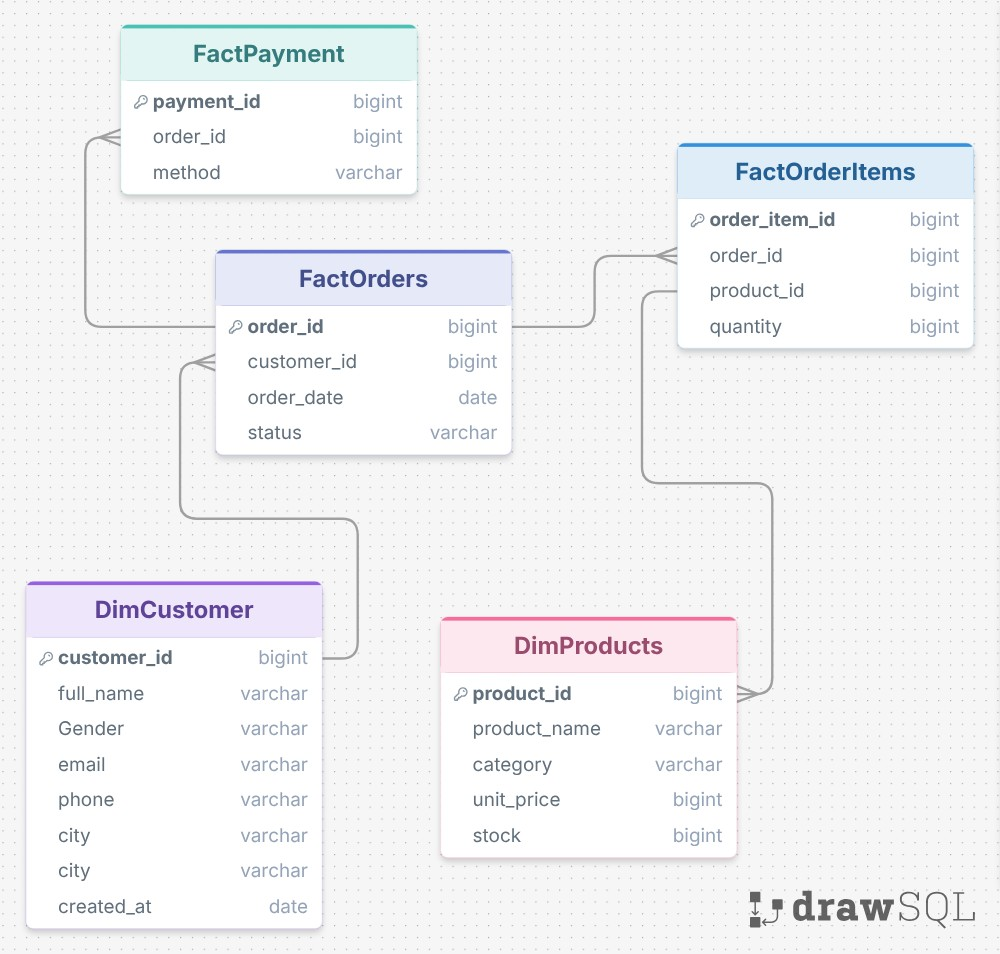
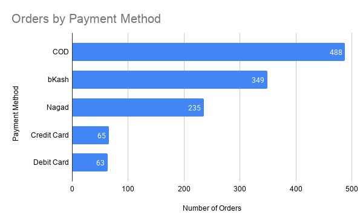
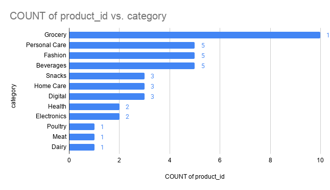

# Data Analysis For UrbanCart 
(Currently working on this project, only visualization to be done)

## Dataset Overview

This repository contains a structured **e-commerce sales dataset** designed for SQL practice, data cleaning, exploratory data analysis, dashboard development, and business-intelligence projects.

The dataset represents customer orders, purchased products, order-level details, and selected payment methods within a Bangladesh-oriented retail context.

It follows a relational data model with dimension and fact tables. The dataset can be used to analyse sales performance, customer behaviour, product demand, order-status trends, payment-method preferences, and operational performance.

---

### Dataset Summary

| Metric              |                                Value |
| ------------------- | -----------------------------------: |
| Total Customers     |                                  100 |
| Total Products      |                                   41 |
| Total Orders        |                                1,200 |
| Total Order Items   |                                4,621 |
| Total Units Ordered |                               11,509 |
| Product Categories  |                                   12 |
| Payment Methods     |                                    5 |
| Order Date Range    | 14 September 2025 – 12 December 2025 |

---

### Dataset Files

| File Name            |  Rows | Description                                                                                                      |
| -------------------- | ----: | ---------------------------------------------------------------------------------------------------------------- |
| `DimCustomers.csv`   |   100 | Contains customer profile information, including name, gender, email, phone number, city, and registration date. |
| `DimProducts.csv`    |    41 | Contains product details, including product name, category, unit price, and stock quantity.                      |
| `FactOrders.csv`     | 1,200 | Contains order-level information, including customer reference, order date, and order status.                    |
| `FactOrderItems.csv` | 4,621 | Contains product-level line items for each order, including ordered quantity.                                    |
| `FactPayment.csv`    | 1,200 | Contains the selected payment method linked to each order.                                                       |

---

### Table Schema

##### `DimCustomers.csv`

| Column        | Description                         |
| ------------- | ----------------------------------- |
| `customer_id` | Unique identifier for each customer |
| `full_name`   | Customer name                       |
| `Gender`      | Customer gender                     |
| `email`       | Customer email address              |
| `phone`       | Customer contact number             |
| `city`        | Customer location                   |
| `created_at`  | Customer registration date          |

##### `DimProducts.csv`

| Column         | Description                                         |
| -------------- | --------------------------------------------------- |
| `product_id`   | Unique identifier for each product                  |
| `product_name` | Product name                                        |
| `category`     | Product category                                    |
| `unit_price`   | Current listed price of the product                 |
| `stock`        | Available stock value recorded in the product table |

##### `FactOrders.csv`

| Column        | Description                                                  |
| ------------- | ------------------------------------------------------------ |
| `order_id`    | Unique identifier for each order                             |
| `customer_id` | Customer associated with the order                           |
| `order_date`  | Date on which the order was placed                           |
| `status`      | Current order status: `Completed`, `Pending`, or `Cancelled` |

##### `FactOrderItems.csv`

| Column          | Description                               |
| --------------- | ----------------------------------------- |
| `order_item_id` | Unique identifier for each order-item row |
| `order_id`      | Order associated with the line item       |
| `product_id`    | Product included in the order             |
| `quantity`      | Number of units ordered                   |

##### `FactPayment.csv`

| Column       | Description                                        |
| ------------ | -------------------------------------------------- |
| `payment_id` | Unique identifier for each payment-method record   |
| `order_id`   | Order associated with the payment-method selection |
| `method`     | Selected payment method                            |

---

### Data Model Relationships

---

### Order Status Distribution

| Order Status | Number of Orders | Percentage |
| ------------ | ---------------: | ---------: |
| Completed    |              713 |     59.42% |
| Cancelled    |              246 |     20.50% |
| Pending      |              241 |     20.08% |
| **Total**    |        **1,200** |   **100%** |

---

### Payment Methods

---

### Product Categories

The dataset includes products from 12 categories:

* Grocery
* Beverages
* Personal Care
* Fashion
* Home Care
* Digital
* Snacks
* Health
* Electronics
* Meat
* Poultry
* Dairy

---

---

### Data Quality Notes

The relationships between the tables are structurally consistent:

* Each order is linked to a valid customer.
* Each order item is linked to a valid order and product.
* Every order contains at least one order-item record.
* Every order has one linked payment-method record.
* No duplicate primary keys were identified.

However, several limitations should be considered:

1. The order-item table does not store the historical selling price at the time of purchase. Any sales calculation based on `unit_price` should be described as a **gross sales estimate** or **gross sales proxy**.
2. The payment table stores the selected payment method but does not include payment amount, payment status, transaction timestamp, or refund information.
3. The stock column does not include an inventory movement history.
4. Some customer registration dates are missing.
5. Customer phone numbers should be validated and cleaned before using them for operational purposes.

---

#### Important Note

This dataset should be treated as a learning or portfolio dataset. It should not be used for official financial reporting without adding transaction-level prices, verified payment information, inventory movements, and stronger data-quality controls.
